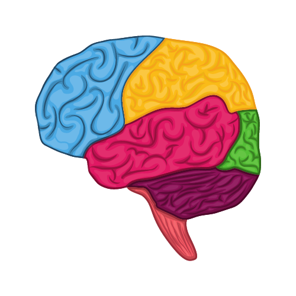
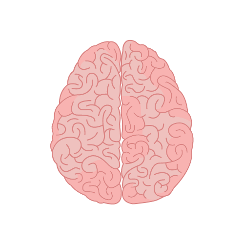

# Brain Tumor Detection Using MRI Scans

Dataset Br35H 👉🏻 https://www.kaggle.com/ahmedhamada0/brain-tumor-detection

Dataset MRI Images 👉🏻 https://www.kaggle.com/navoneel/brain-mri-images-for-brain-tumor-detection

---
[](https://github.com/ArpitAggarwal10/Brain_Tumor_Detection_Using_MRI_Scans_Minor-Project.git)

<!-- PROJECT LOGO -->
<br />
<p align="center">
  <a href="https://github.com/ArpitAggarwal10/Brain_Tumor_Detection_Using_MRI_Scans_Minor-Project.git">
    
  </a>
  <!-- INTRODUCTION -->

## Objective
  
Brain tumors are the consequence of abnormal growths and uncontrolled cells division in the brain. They can lead to death if they are not detected early and accurately. Some types of brain tumor such as Meningioma, Glioma, and Pituitary tumors are more common than the others.

In this project, I designed & built an automatic brain tumor segmentation technique based on Convolutional Neural Network. MRI scan is used because it is less harmful and more accurate than CT brain scan.
  
<!-- ABOUT THE PROJECT -->
## About The Project

<a href="https://github.com/ArpitAggarwal10/Brain_Tumor_Detection_Using_MRI_Scans_Minor-Project.git">
    
  </a>

Brain tumors are the consequence of abnormal growths and uncontrolled cells division in the brain. They can lead to death if they are not detected early and accurately. Some types of brain tumor such as Meningioma, Glioma, and Pituitary tumors are more common than the others.

In this project, I designed & built an automatic brain tumor segmentation technique based on Convolutional Neural Network. We have used three MRI views of human brain. MRI scan is used because it is less harmful and more accurate than CT brain scan.

A list of commonly used resources that I find helpful are listed in the acknowledgements.

---

### Libraries used : 

```
  * Keras
  * TensorFlow
  * sklearn 
  * Open Cv
  * Pillow 
  * Numpy
  * Flask
  * Werkzeug
```
---

## Algorithms Used

> * VGG16 (Transfer Learning in Deep Learning)

## Directory Structure

```sh
├── Brain_Tumour_Detection_using_MRI_scans.ipynb
├── brain_tumour_detection_using_mri_scans.py
├── images
│   └── logo.png
├── README.md
└── Test Dataset
    ├── Normal
    │   ├── no1.jpg
    │   ├── no2.jpg
    │   ├── no3.jpg
    │   ├── no4.jpg
    │   └── no5.jpg
    └── Tumour
        ├── y1.jpg
        ├── y2.jpg
        ├── y3.jpg
        ├── y4.jpg
        └── y5.jpg
```
<!-- GETTING STARTED -->
## Getting Started

This is an example of how you may give instructions on setting up your project locally.
To get a local copy up and running follow these simple example steps.

### Prerequisites

Create a virtualenv. (optional)
  ```sh
  python3 -m venv braintumour
  source braintumour/bin/activate
  ```
### Installation

1. Clone the repo
   ```sh
   git clone https://github.com/ArpitAggarwal10/Brain_Tumor_Detection_Using_MRI_Scans_Minor-Project.git
   ```
2. Install required libraries
   ```sh
   pip install -r requirements.txt
   ```
<!-- USAGE EXAMPLES -->
## Usage

Now run the app.py file by typing following command 
```sh
   python app.py
   ```
_For more examples, please refer to the [Documentation](#)_

## About Contribution :
* Raise the `issue` .
* Work on raised issues .
* Come up with interesting Medical related problems and solutions .
* You can improve the UI/UX .
* Can contribute on readme files as well .

---
                          "What we know is a drop, what we don't know is an ocean."
                                                                — Isaac Newton
---

[](https://github.com/ArpitAggarwal10/Brain_Tumor_Detection_Using_MRI_Scans_Minor-Project.git)